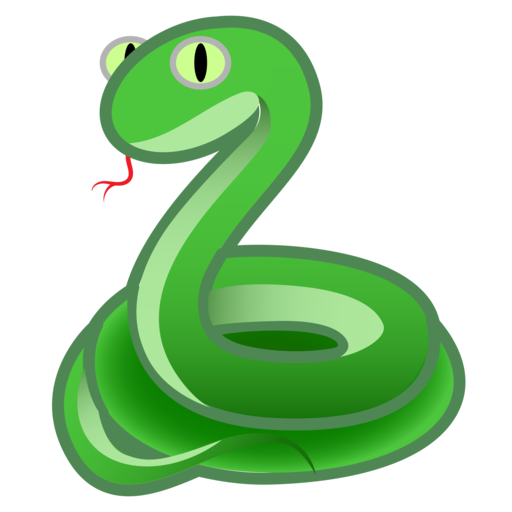
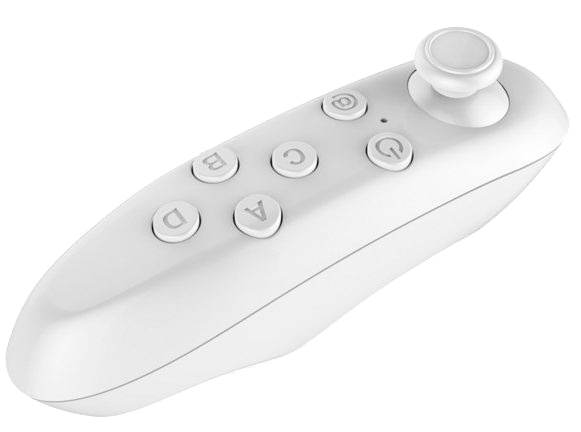
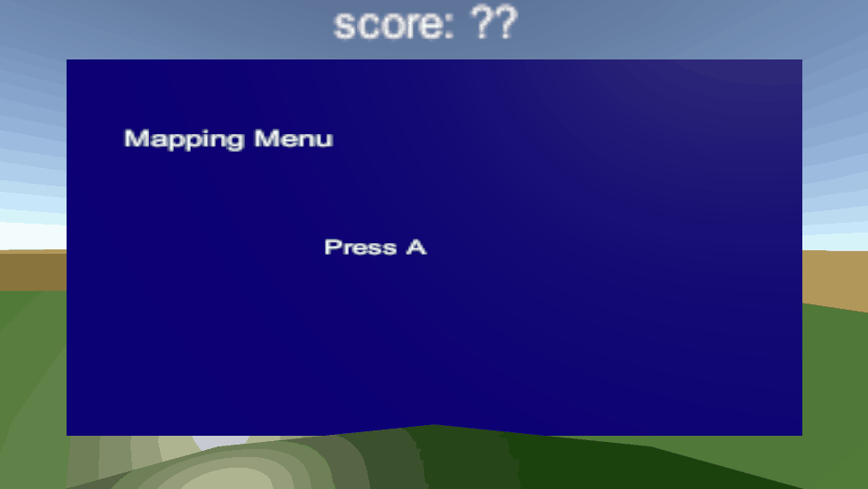
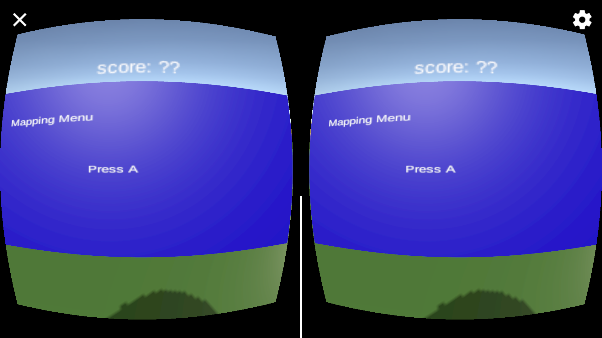

<h1 align="center">
   
  
   
  SnakeVR
   
</h1>

<h4 align="center">An application made with <a href="https://flutter.dev/" target="_blank">Unity</a></h4>

  <a href="#what-is-it">What it is</a> •
  <a href="#getting-started">Getting Started</a> •
  <a href="#preview">Preview</a> •

## What it is

This is a Unity project with the files of the mithical game: Snake in this case is the VR aproach of that game. In this game you can controll the snake with a bluetooth controller while you move your head to see where your prey is. The game allows you to play in firs person or in thirth person mood. And select multiple dificulty levels.
Also allows you to use the bluetooth controller configuration of your choice the first time you run it.

This project was made for the the Virtual Reality subject at ITBA (Technological Institute of Buenos Aires).

## Requirements

To edit the game you only need Unity installed on your computer, preferably the 2019.4.17 version to avoid versioning problems.

To play the game either on the computer or in the cell phone, you need a bluetooth controller, the one we use to play is showed on the next image.

## Getting Started

### Use from Unity

To use te project from unity you need to open your unity hub, tap the "add" button and select the folder of this project.

Once done you have to connect your controller to bluetooth with your computer and put the controller in VR mode, usually you can do that pressing @+B at the same time, but that can change depending of the brand of your controller.

Once conected you can hit run and the game will start with the blue controll configuration screen, and after you maps the controll's buttons you can play the game in your computer. It may happen that your joystick is inverted, don't worried in the game's menu, you can select your joystick axis preference.

### Use from Android

To use from Android you can build the project by clicking project->build in your Unity program, that will create an apk that you could use in your cell phone.

Another way is to use the android apk that it is in this link, you can download it from your device and once done it will ask you if you want to install that file, select install and that's it, you have your Snake VR Game installed.

To play with it connect your bluetooth controller device and change it mode to VR mode, usually you can do that pressing @+B at the same time, but that can change depending of the brand of your controller.

### Use from IOS

Unfortunatly we don't have a Mac to compile the project for ios, but in the case that you use an iPhone, you could compile the project on your Mac following the "Use from Unity" section, and then use the app in your iPhone

## Preview

### Controller Configuration

### Game

(this may take time to load in github)

### View from cell phone

